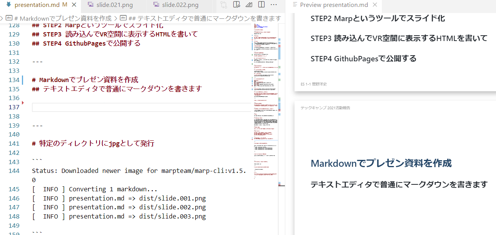

# ２０２１年度 活動報告

-----
# お届けしているこのプレゼンツールについて

あとで解説します。

----
# 今年の計画

##  HTMLマークアップでWebXRを実現するa-frameと、WebSocket/WebRTCを利用し、仮想空間上の共有ワークスペースを作成する

---- 

# a-farme 

HTMLマークアップでシーン情報を構築すると、WebGLで描画が行われれて、さらにWebXRと連携して仮想空間を構築することができるフレームワーク(ヘッドセットやスマホARに対応)

# Websocket/WebRTC

ブラウザ間(P2P)で各種情報(画像や音声を含む)を交換する。

これらの仕組みによってVR/XR空間上の共通ワークスペースを作る予定だった。


---- 
# なかなか作業できず。。

AR三目ならべを作ったぐらいで作業中断

## 大きめの新規案件が始まったため


## 多少のモチベーションの低下

すでに商用レベルで優れたソリューションが多数存在するのでいまさら感がある。

これはテックキャンプに取り組むときの共通の課題です


--- 
# 2021年はVR/AR元年

## ここ十年は毎年言われているが、昨年は確実に趨勢が変わった。

---
# メタバースがバズワード化した

facebookがMeta社に改名
https://japanese.engadget.com/meta-facebook-185351672.html

## メタバース元ネタ


----

# 仮想空間上の共有スペース

#### VRChat
VRSNS
####  Horizon Workrooms
Meta社が提供しているバーチャルワークスペース
####  Spatial
Oculus Quest2 や最大50人までの無料プランなどを発表
####  cluster
デジタル渋谷などのバーチャルイベントに利用されている

----


---- 
# レッドオーシャンになったVR/VR界隈

### VR/XRを用いた共同ワークスペースなどは、すでに商用レベルのソリューションはかなり存在しており、いまさら新しいなにかを作ることはできない

※サーベイは引き続き重要ですが、。。

----


# あらためてコンセプトを練り直す


----
# VR/XRの普段つかい

## 高度な技術を利用しなくても、技術者が自分自身が便利に使うための日常的なツールをWebXRの技術を使って作成でいないだろうか?


---
# 思いついたのが、お届けしているこのプレゼンツール

マークダウンでプレゼン資料を作ると、自動的にVR空間でプレゼンを閲覧可能にするツール。


---
# 元ネタ

VR空間でマインドパレスを作成している人を見かけた。

--- 
# マインドパレスとは?

場所（自宅や実際にある場所でも、架空の場所でも良く、体の部位に配置する方法もある）を思い浮かべ、そこに記憶したい対象を置く方法である。「記憶の宮殿」「ジャーニー法」「基礎結合法」とも呼ばれる。記憶したい対象を空間に並べていく方法である。人間は例えば他人の家に行った場合でも、どこに何があったかは比較的よく覚えており、その性質を利用する。

BBCのシャーロックホームズ等で出てきます。

---
# というわけで

## プレゼンもVR空間に配置できたら印象的になるのでは?

--- 
# ツールの機能

## STEP1 マークダウンでプレゼンの中身を書いて
## STEP2 Marpというツールでスライド化
## STEP3 読み込んでVR空間に表示するHTMLを書いて
## STEP4 GithubPagesで公開する

---

# Markdownでプレゼン資料を作成
## テキストエディタで普通にマークダウンを書きます



---

# marpというツールでスライド化

### pngにエキスポート

```
gitpod /workspace/techcamp_2022 $ docker run --rm -v $PWD:/home/marp/app/ -e LANG=$LANG -e MARP_USER="$(id -u):$(id -g)"   marpteam/marp-cli:v1.5.0  presentation.md  --allow-local-files true --images   png -o dist/slide.png 
[  INFO ] Converting 1 markdown...
[  WARN ] Insecure local file accessing is enabled for conversion from
          presentation.md.
[  INFO ] presentation.md => dist/slide.001.png
[  INFO ] presentation.md => dist/slide.002.png
[  INFO ] presentation.md => dist/slide.003.png
[  INFO ] presentation.md => dist/slide.004.png
[  INFO ] presentation.md => dist/slide.005.png
[  INFO ] presentation.md => dist/slide.006.png
[  INFO ] presentation.md => dist/slide.007.png
[  INFO ] presentation.md => dist/slide.008.png
```

----
# ツール(a-frame)による読み込み

aipine.jsという軽量Webフレームワークも利用しています。

```html
  <a-scene x-data="scene">
    <template x-for="slide in slides">
      <a-plane slide @click="next" width="1.2" position="0,-100,0" :position="slide.pos" :id="slide.id"
        :src="slide.src">
      </a-plane>
    </template>

    <a-camera :position="cameraPos" cursor-visible="true" cursor-scale="2" cursor-color="#red" cursor-opacity="0.5">
      <a-cursor></a-cursor>
    </a-camera>

    <a-entity position="0 0 0" geometry="primitive: plane; width: 10000; height: 10000;" rotation="-90 0 0"
      material="src: #grid; repeat: 10000 10000; transparent: true; metalness:0.6; roughness: 0.4; sphericalEnvMap: #sky;">
    </a-entity>
    <a-sky src="#sky" rotation="0 -90 0"></a-sky>
```
---
# VR空間上のプレゼンツールとして発行

今見ているこの画面です。

---- 
# 上記の作業をGithubActionとして自動化


資料をpushすると自動発行するようになっています。


---- 
# 応用

## プレゼン空間内に感想を残すような仕組み

## スライドを観ている人同士をWebSorket/WebRTCで繋いでリアルタイムで反応を共有


---- 

# 結論

VR/XR系の技術に身構えるのではなく、普段使いできるような気軽な利用法を考えることができた